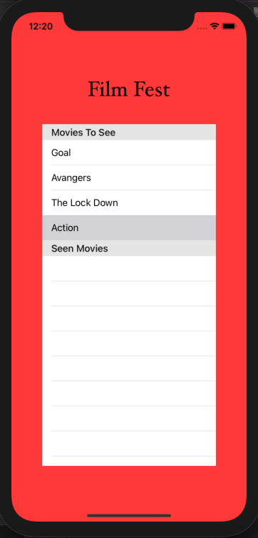

# ios-unit-tests
writing unit tests for this ios demo

test suites covers the following: 

1. Manager class
2. cell configration class
3. cell selection 
4. tableView data source delegate 
5. tableView delegate 
6. library data service
7. viewController
8. Struct

